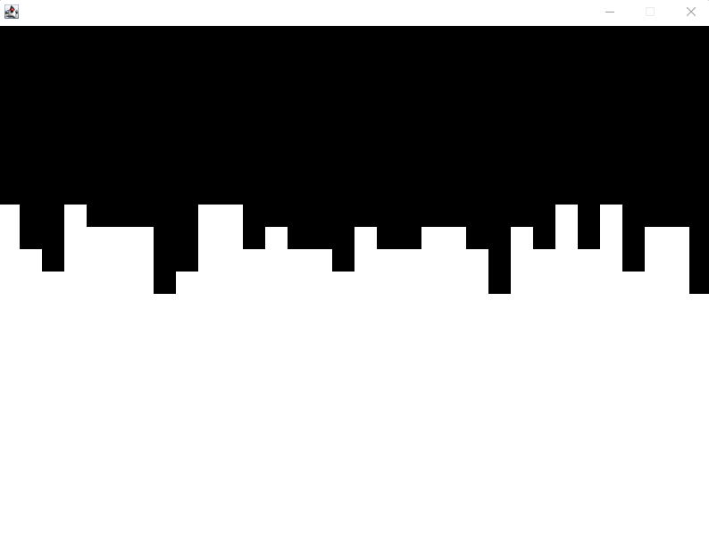
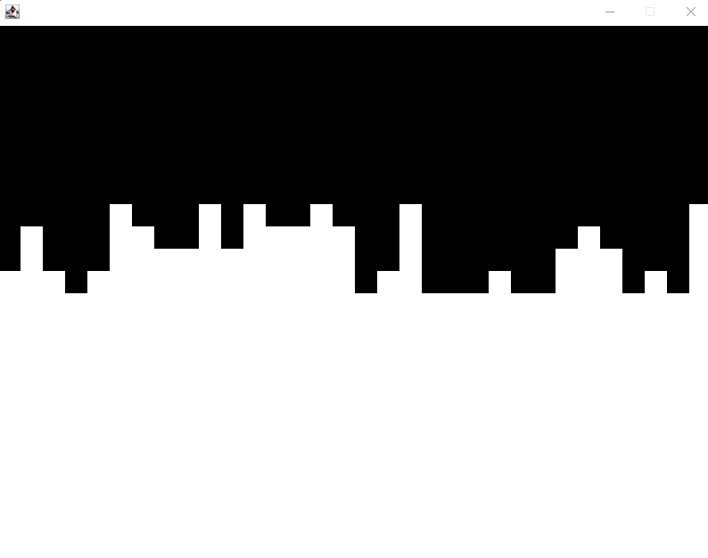

# Procedural Generation
Das ist mein erstes Programm, welches die paint()- bzw paintComponent()-Methode überschreibt um etwas zu malen. In diesem 
Fall "malt" das Programm, bei jedem Neustart, zufällige Landschaften. Da es erstmal nur um das Grundkonzept von Graphics g
(Graphics2D) ging ist das Programm auch relativ simpel gehalten und hat z.B. keinen Button, der das Neustarten erleichtert. 

Nach dem Neustart:

